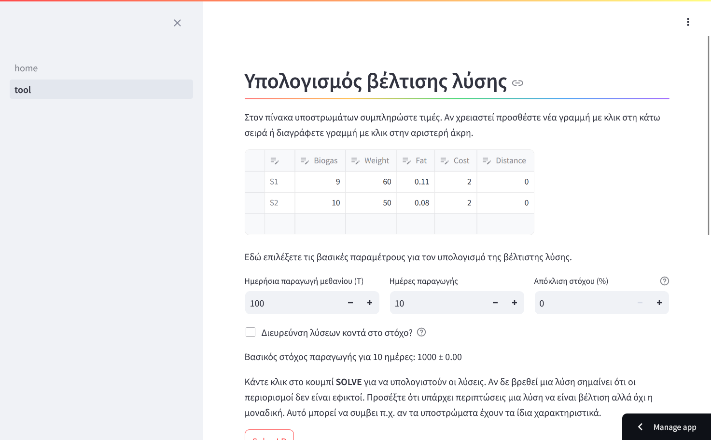

# SmartCH4 Linear Optimization 

Application to optimize methane cost/production using a linear optimization algorithm from Google OR-Tools library. Linear optimization (also known as linear programming) is a technique for computing the optimal solution to a problem modeled as a set of linear relationships.

Εφαρμογή για τη βελτιστοποίηση τους κόστους / παραγωγής μεθανίου με τη χρήση αλγορίθμου γραμμικής βελτιστοποίσης της βιβλιοθήκης Google OR-tools. Η γραμμική βελτιστοποίηση (γνωστό και ως γραμμικός προγραμματισμός) είναι μια τεχνική για τον υπολογισμό της βέλτισης λύσης σε ένα πρόβλημα που μοντελοποιείται ως ένα σύνολο γραμμικών σχέσεων.

## Installation / Εγκατάσταση
Create and activate a python virtual environment.

Δημιουργήστε και ενεργοποιήστε ένα python virtual environment.

`pip install streamlit ortools`

`streamlit run home.py`

## Usage / Χρήση
The homepage includes the problem description. Select **tool** from the sidebar to test the algorithm. Currently instruction are only in greek.

Η αρχική σελίδα περιλαμβάνει την περιγραφή του προβλήματος. Επιλέξτε **tool** από την πλαϊνή γραμμή για να δοκιμάσετε τον αλγόριθμο. Προς το παρόν οι οδηγίες είναι μόνο στα ελληνικά.